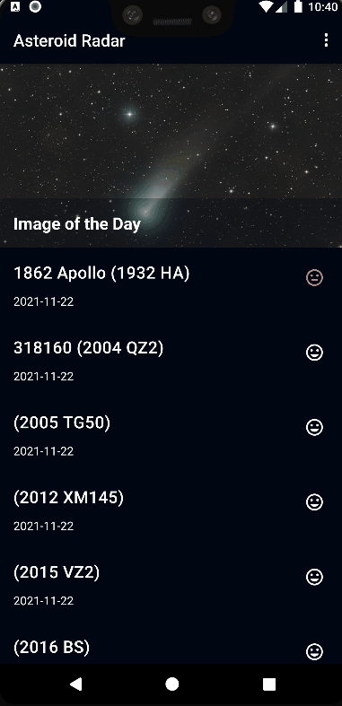

# AsteroidRadar
It's A Project for the Nano Degree of The Advanced Track of Android using Kotlin
Lessons in this course is probably the most useful and practical one in my opinion. 
The lessons:
* include App Architecture (Persistence),
* RecycleView,
* Connect to the Internet, 
* Behind the Scenes, 
* and Designing for Everyone.

## What I learned?

* RecycleView (display list of asteroids)
* Retrofit (download data from internet)
* Moshi (convert JSON data to usable class data)
* Picasso (download and cache images)
* BindingAdapter(implement custom attribute in layout xml)
* Room Database (implement offline caching)
* Work Manager(schedule to update database every day)
* Accessibility (provide basic accessibility such as content description for texts and images)
## What The App look like?
